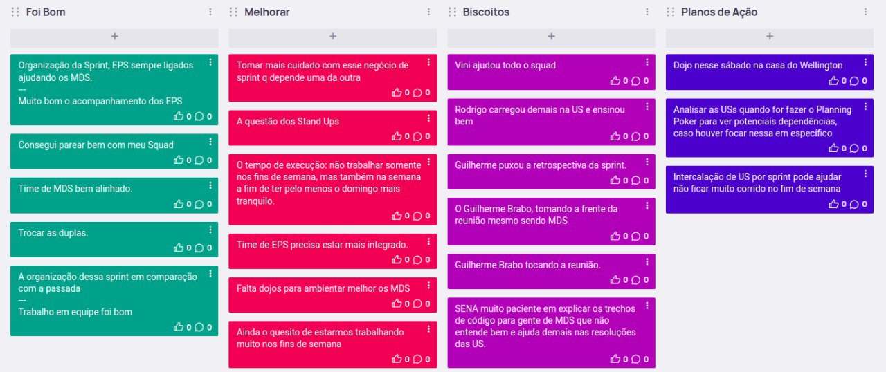
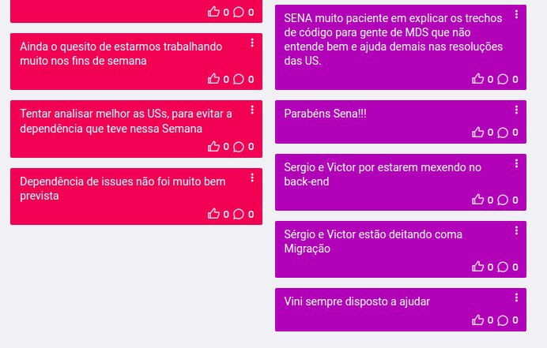

# Sprint 2
## Visão geral
**Data de Inicio:** 23/05/2023

**Data de Término:** 30/05/2023

## Atividades realizadas
### Reunião dia 23/05/2023
**Participantes**

| Papel | Membro |
| ----- | ------ |
| EPS | Arthur Sena, Peniel Zannoukou, Rodrigo Lima, Victor Lucas, Vinícius Souza, Wellington Jonathan | 
| MDS | Ana Cavalcanti, Artur Fontinele, Flávio Melo, Guilherme Gonçalves, Gustavo Sorte, Harryson Martins, Juan Pablo Ricarte, Leandro Oliveira, Oscar Neto, Yan Paulo |

- Assuntos abordados:
    - Novos rituais propostos
        - Reunião com o Cliente toda Segunda às 20h
            - Ouvir os comentários do Cliente sobre o que foi trabalhado na
Sprint
        - Refinamento toda Segunda após a reunião com o Cliente
            - Com o que foi falado pelo Cliente, já pensar em novas soluções
        - Sprint Review + Planning toda Terça às 20h
            - Duração de 40 minutos
            - Planejar o que será feito na Sprint, separar as USs
        - Retrospectiva toda Terça após a Review + Planning
            - Comentários do que foi bom e o que foi ruim no decorrer da Sprint
        - Daily nos dias seguintes às 20h
            - Para saber se está fluindo, se está travado, o que vai fazer para
andar, etc
            - Além de fazer Stand Ups durante o intervalo entre as aulas de
EPS e MDS
            - Caso não consiga participar, mandar os relatórios por texto no
canal de comunicação
        - Reuniões de Team Build
            - Reuniões casuais para o time conversar fora de um âmbito acadêmico, com a intenção de
            melhorar o entrosamento do time como um todo
    - Sprint Review
        - Foi feito e usado como base para o planejamento da próxima Sprint
    - Sprint Planning
        - USs para Sprint
            - Foi feito uma rotação nos times de pareamento
            - US06 (Status do Processo)
                - Leandro, Oscar, Yan, Harryson, Peniel, Rodrigo
            - US35 (Fim de Processo)
                - Guilherme, Artur e Vinicius
            - US37 (Visualização de Etapas por Unidade)
                - Gustavo, Ana e Wellington
            - US38 (Visualização de Processos por Unidade)
                - Flávio, Juan e Sena
            - Sergio e Victor serão responsáveis por um dojo de BackEnd
    - Retrospectiva
        - Foi usado o EasyRetro
            - Foi bom
                - De fato conseguimos entregar as USs planejadas para a
Release 1
                - MDSs bem presentes nos processos de desenvolvimento,
melhorando o andamento do time, como um time de fato
            - Melhorar
                - Tentar não rushar as sprints
                - Organização de mais horários para o time se reunir
                - Enquanto estiver precisando de Dojos, eles podem ser
feitos
            - Planos de Ações
                - Melhorar rotinas de Planejamento
                - Manter dojos novos quando necessários
                - Manter comunicações diárias
                - Definir rotinas de Validação com o Cliente
                    - Mandar os protótipos da próxima Sprint na Quarta
ou Quinta
                    - Mandar para o Teste de Aceitação, assim que a US
ficar pronta, não precisando esperar para o Cliente
validar todas as USs para a Release Major, e sim
fazer Releases Minor assim que fechar um PR
                    - Validações feitas pelo GitHub

**Redator**: Guilherme de Sá Gonçalves

### Reunião dia 29/05/2023
**Participantes**

| Papel | Membro |
| ----- | ------ |
| Professor | Hilmer Rodrigues Neri |
| Cliente | Wellington José Barbosa Carlos |
| Mentor |  Fernando Miranda |
| Monitores | Ana Luiza, Chaydson Ferreira, Pedro Carvalho |
| EPS | Arthur Sena, Peniel Zannoukou, Rodrigo Lima, Sérgio Cipriano, Victor Lucas, Vinícius Souza, Wellington Jonathan | 
| MDS | Ana Cavalcanti, Artur Fontinele, Flávio Melo, Guilherme Gonçalves, Gustavo Sorte, Harryson Martins, Juan Pablo Ricarte, Leandro Oliveira, Oscar Neto, Yan Paulo |

- Assuntos abordados:
    - RoadMap
        - Release 2, Etapas e Desempenho
            - Iniciar um processo, finalizar um processo, arquivamento do processo, visualização da etapa no fluxo, nome de etapas iguais
        - O que já foi feio na Sprint
            - US06 - Status do Processo
            - US37 - Gerenciamento de Processos
            - US38 - Gerenciamento de Etapas
            - Porém ainda não foi mandado para validação, por problemas pontuais, como problema com o ambiente, banco de dados, etc
                - Cliente pediu para que se possível, alguém do time sempre o acompanhar na hora da validação para tirar uma dúvida na hora e assim acelerar o processo de validação
                - O cliente marcaria um horário e mandaria um link, para quem estiver disponível entrar
        - O que está sendo revisado
            - US35 - Finalizar processo
            - US34 - Início do processo
            - As etapas de Início e Fim são definidas pela sequência delas quando foi criado o fluxo, o Cliente achou perfeito
        - O que será trabalhado a seguir
            - US03 - Retrocesso de Etapas
            - US04 - Adição de Etapas com nomes iguais
            - US05 - Visualização da duração de etapas
            - US07 - Registro de data por etapa
        - Fora isso, o trabalho nos requisitos não funcionais foi continuado durante a Sprint
            - A refatoração dos Micro Serviços está com previsão de ser finalizado até o dia 04/06
    - Regra de Negócio para Processos
        - O Processo não pode aparecer em mais de uma unidade, porém o Processo pode estar dentro de mais de um Fluxo, porém na mesma Unidade.
        - Os Status do Processo é por Fluxo, em um determinado fluxo, um processo pode estar “arquivado”, mas em outro fluxo, “finalizado”
        - O Registro deixará de ser uma chave única, para ser possível colocar um mesmo processo em fluxos diferentes
        
**Redator**: Guilherme de Sá Gonçalves

### Reunião dia 29/05/2023
**Participantes**

| Papel | Membro |
| ----- | ------ |
| EPS | Arthur Sena, Peniel Zannoukou, Rodrigo Lima, Sérgio Cipriano, Victor Lucas, Vinícius Souza, Wellington Jonathan |
| MDS | Ana Cavalcanti, Artur Fontinele, Flávio Melo, Guilherme Gonçalves, Leandro Oliveira |

- Assuntos abordados:
    - Remodelação da relação dos Processos
        - De acordo com o que foi dito, agora um Processo pode ter vários Fluxos
diferentes
            - No Front, em vez de puxar da tabela de “Process”, passar a
chamar da “FlowProcess”
            - No Banco/Backend, a criação do Processo, deve permitir mesmo
“record”, mas fluxos diferentes
    - Priorizar terminar as issues, porém trabalhando na refatoração dessa parte

**Redator**: Guilherme de Sá Gonçalves

## Issues Concluidas
| Issue | Responsáveis(s) |
| ----- | ---------------- |
|[Finalizar migração do frontend](https://github.com/fga-eps-mds/2023-1-CAPJu-Doc/issues/23)| Arthur Sena, Victor Lucas |
|[Criar serviço de usuário](https://github.com/fga-eps-mds/2023-1-CAPJu-Doc/issues/45)| Victor Lucas |
|[E01 - Usabilidade](https://github.com/fga-eps-mds/2023-1-CAPJu-Doc/issues/57)| Arthur Sena, Wellington Jonathan |
|[US01 - Experiencia com a plataforma](https://github.com/fga-eps-mds/2023-1-CAPJu-Doc/issues/58)| Arthur Sena, Victor Lucas, Wellington Jonathan |
|[US02 - Informações de acesso](https://github.com/fga-eps-mds/2023-1-CAPJu-Doc/issues/59)| Arthur Sena, Peniel Zannoukou, Victor Lucas, Wellington Jonathan |
|[E03 - Unidade](https://github.com/fga-eps-mds/2023-1-CAPJu-Doc/issues/69)| Arthur Sena, Wellington Jonathan |
|[US08 - Controle de unidades](https://github.com/fga-eps-mds/2023-1-CAPJu-Doc/issues/70)| Ana Cavalcanti, Arthur Sena, Guilherme Gonçalves, Gustavo Sorte, Juan Pablo Ricarte, Vinícius Souza, Wellington Jonathan |
|[US09 - Gerencionamento de diretores](https://github.com/fga-eps-mds/2023-1-CAPJu-Doc/issues/71)| Arthur Sena, Guilherme Gonçalves, Wellington Jonathan |
|[US10 - Gerenciamento de fluxos](https://github.com/fga-eps-mds/2023-1-CAPJu-Doc/issues/72)| Arthur Sena, Rodrigo Lima, Wellington Jonathan |
|[Refatoração do Frontend](https://github.com/fga-eps-mds/2023-1-CAPJu-Doc/issues/123)| Arthur Sena, Sérgio Cipriano, Victor Lucas |
|[Construir Protótipo da US03](https://github.com/fga-eps-mds/2023-1-CAPJu-Doc/issues/135)| Arthur Sena, Victor Lucas, Wellington Jonathan |
|[Construir Protótipo US05](https://github.com/fga-eps-mds/2023-1-CAPJu-Doc/issues/139)| Arthur Sena, Flávio Melo, Juan Pablo Ricarte, Vinícius Souza, Wellington Jonathan |
|[Construir Protótipo US06](https://github.com/fga-eps-mds/2023-1-CAPJu-Doc/issues/141)| Arthur Sena, Artur Fontinele, Harryson Martins, Leandro Oliveira, Oscar Neto |
|[Construir Protótipo US07](https://github.com/fga-eps-mds/2023-1-CAPJu-Doc/issues/142)| Ana Cavalcanti, Arthur Sena, Guilherme Gonçalves, Gustavo Sorte |
|[Cadastro na plataforma permite e-mail duplicado](https://github.com/fga-eps-mds/2023-1-CAPJu-Doc/issues/155)| Arthur Sena |
|[Mensagem de erro ao tentar realizar cadastro com CPF já cadastrado](https://github.com/fga-eps-mds/2023-1-CAPJu-Doc/issues/156)| Arthur Sena |
|[Ações numa tabela da aba de cadastro não atualizam a outra](https://github.com/fga-eps-mds/2023-1-CAPJu-Doc/issues/157)| Arthur Sena |
|[Ações com erro estão com loading infinito](https://github.com/fga-eps-mds/2023-1-CAPJu-Doc/issues/158)| Arthur Sena |
|[Usuário administrador não deve ser associado a nenhuma unidade](https://github.com/fga-eps-mds/2023-1-CAPJu-Doc/issues/159)| Arthur Sena |
|[Usuário administrador não deve ver abas de etapas, fluxos e processos](https://github.com/fga-eps-mds/2023-1-CAPJu-Doc/issues/160)| Arthur Sena |
|[Ícone de lixeira na tabela de solicitações está errado](https://github.com/fga-eps-mds/2023-1-CAPJu-Doc/issues/161)| Arthur Sena |
|[Melhorias nas ações já existentes da plataforma](https://github.com/fga-eps-mds/2023-1-CAPJu-Doc/issues/162)| Arthur Sena |
|[Solicitação de cadastro consta com a unidade errada](https://github.com/fga-eps-mds/2023-1-CAPJu-Doc/issues/168)| Arthur Sena |
|[Alterar função que retorna de listagem de etapas para retornar apenas as da unidade do usuário](https://github.com/fga-eps-mds/2023-1-CAPJu-Doc/issues/169)| Ana Cavalcanti, Artur Fontinele, Gustavo Sorte, Vinícius Souza, Wellington Jonathan |
|[BUG - Visualizar Processo no Fluxo](https://github.com/fga-eps-mds/2023-1-CAPJu-Doc/issues/174)| Arthur Sena, Artur Fontinele, Guilherme Gonçalves, Vinícius Souza, Wellington Jonathan |

## Retrospectiva

## Histórico de versão
| Data | Versão | Descrição | Autor(es) |
| ---- | ---- | ---- | ---- |
| 25/05/2023 | 0.1.0 | Criação do Documento | Ana Cavalcanti e Guilherme Gonçalves |
| 31/05/2023 | 0.1.1 | Atualização do Documento | Ana Cavalcanti e Guilherme Gonçalves |