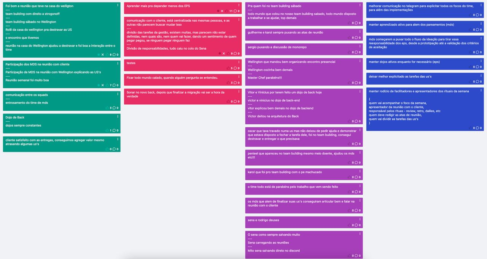

# Sprint 3
## Visão geral
**Data de Inicio:** 30/05/2023

**Data de Término:** 06/06/2023

## Atividades realizadas
### Reunião dia 30/05/2023
**Participantes**

| Papel | Membro |
| ----- | ------ |
| EPS | Arthur Sena, Peniel Zannoukou,  Vinícius Souza, Wellington Jonathan | 
| MDS | Ana Cavalcanti, Artur Fontinele, Flávio Melo, Guilherme Gonçalves, Gustavo Sorte, Harryson Martins, Juan Pablo Ricarte, Leandro Oliveira, Oscar Neto, Yan Paulo |

- Assuntos abordados:
    - Sprint review
        - Foi planejado 16 pontos, levando em consideração que teria USs que demandaria mais de uma sprint para ser finalizada
        - Foi entregue 3 pontos, que foram as de gerenciamento de Etapas, Processos e Cadastro, (USs 37, 38 e 39) aguardando apenas a validação
        - Os 13 pontos restantes estão em progresso, (USs 06, 34 e 35) com expectativa para entregar no fim da Sprint
    - Discussão sobre a issue #122 - Remover filtragem do lado cliente (Frontend)
        - É uma US?
            - A issue consiste em melhorar a responsividade do Front, supondo que haja 1000 etapas, e o usuário escreva na barra de pesquisa “Mover”, os resultados só apareceriam depois de dar um Enter, ou clicar em um ícone de Lupa
    - Planning Poker das USs
        - US36 - Arquivar Processo - 3
            - Além de fazer o mesmo do que “Iniciar Processo” e “Finalizar Processo”, a visualização dos botões mudaria quando o processo estivesse arquivado, sumiria os outros botões e ficaria um único de “Desarquivar”
        - US04 - Etapas com nomes iguais e duração diferente
            - Essa US foi para IceBox, pois ela precisa ter um refinamento nos seus requisitos com o Cliente, pois supostamente ela já está feita
        - US05 - Visualização da duração de etapas na criação/edição dos fluxos - 1
            - Adicionar mais um Label no Front no “Select” e no “Flow”, para os dias de duração
        - US03 - Retrocesso de Etapas - 3
            - Fazer o botão de “Retroceder”, levando em consideração a disposição dos botões na página, e atualizar a função que já existe no backend
        - US07 - Registro de data por Etapa - 8
            - Adicionar modal de observação ao avançar a etapa, e mostrar nas labels das Etapas no Fluxo, um novo label com a data em que foi entrado naquela etapa
            - Adicionar a data nos atributos da Etapa no backend
            - A US será quebrada

**Redator**: Guilherme de Sá Gonçalves

### Reunião dia 31/05/2023
**Participantes**

| Papel | Membro |
| ----- | ------ |
| EPS | Peniel Zannoukou, Victor Lucas, Vinícius Souza | 
| MDS | Ana Cavalcanti, Artur Fontinele, Flávio Melo, Guilherme Gonçalves, Gustavo Sorte, Harryson Martins, Juan Pablo Ricarte, Leandro Oliveira, Oscar Neto |

- Assuntos abordados:
    - USs "em progresso" 
        - US06 - Status Do Processo
            - Devido algumas mudanças na relação de Processos e Fluxos, algumas coisas tiveram que ser corrigidas
        - US34 - Início do Processo
            - Ficou dependente da US anterior, por causa de algumas mudanças no BackEnd
        - US35 - Finalizar o Processo
            - Faltou apenas testar a função, com as novas alterações que foram feitas no Back
    - USs que serão puxadas nessa Sprint
        - US36 - Arquivar Processo
            - Ana, Gustavo e Wellington
        - US03 - Retrocesso de Etapa
            - Flávio, Juan e Sena
            - As demais serão decididas quando as que estão em progresso forem finalizadas
    - Retrospectiva
        - Foi bom
            - Organização do time, tanto MDS quanto EPS
            - A troca de duplas
        - Melhorar
            - Tomar cuidado com a dependência das USs
            - Tempo de execução, para evitar trabalhar nos fins de semana
            - Integração dos EPS, estiverem preparados caso um que sempre apresenta não puder
        - Planos de ação
            - Dojo no fim de semana presencial
            - Analisar as USs quando for fazer o Planning Poker para ver potenciais dependências e caso haja, priorizar a US para não atrasar as demais
            - Intercalar as USs por Sprint para ajudar a não ficar muito corrida

**Redator**: Guilherme de Sá Gonçalves

### Reunião dia 05/06/2023
**Participantes**

| Papel | Membro |
| ----- | ------ |
| Professor | Hilmer Rodrigues Neri |
| Cliente | Wellington José Barbosa Carlos |
| Mentor |  Fernando Miranda |
| EPS | Arthur Sena, Peniel Zannoukou, Rodrigo Lima, Sérgio Cipriano, Victor Lucas, Vinícius Souza, Wellington Jonathan | 
| MDS | Ana Cavalcanti, Artur Fontinele, Flávio Melo, Guilherme Gonçalves, Gustavo Sorte, Harryson Martins, Juan Pablo Ricarte, Leandro Oliveira, Oscar Neto, Yan Paulo |

- Assuntos abordados:
    - 4 USs finalizadas aguardando validação
        - US03 - Retrocesso de Etapa
        - US06 - Status do Processo
        - US34 - Início do Processo
        - US35 - Finalizar Processo
        - Cada dupla apresentou o que foi trabalhado em suas USs a pedido do Professor
    - A respeito do Retrocesso de Etapa
        - É necessário ter o tratamento a respeito da data de Vencimento de cada Etapa, a qual é contada assim que se entra na etapa, tanto em Avançar quanto em Retroceder
        - Essa parte foi tratada como uma US futura, porém Professor pontuou que isso seria um critério de aceitação
        - O Cliente pediu para ter uma Modal de Confirmação para o botão de Retrocesso
    - A respeito da Situação Atual
        - Mudar a Situação Atual para em vez de %, colocar i / n, sendo “i” a etapa atual e “n” sendo o total de etapas
        - Quando o Processo não estiver iniciado constará 0/ n
    - A respeito do Arquivamento de Processo
        - Duas formas de Arquivar
            - Uma no meio do Fluxo, chamado de “Arquivar”
            - Uma no final do Fluxo, chamado de “Finalizado”
    - A respeito dos Processos Finalizados
        - Ter um filtro para os Processos Arquivados/Finalizados
    - Validação das USs
        - Foi feita síncrona com alguns membros, e funcionou muito bem, continuará assim

**Redator**: Guilherme de Sá Gonçalves

## Issues Concluidas
| Issue | Responsáveis(s) |
| ----- | ---------------- |
|[Lista de Entrega da Release R_1 (major)](https://github.com/fga-eps-mds/2023-1-CAPJu-Doc/issues/33)| Arthur Sena, Rodrigo Lima, Vinícius Souza, Wellington Jonathan |
|[Atualização das Atas](https://github.com/fga-eps-mds/2023-1-CAPJu-Doc/issues/62)| Ana Cavalcanti, Guilherme Gonçalves |
|[US04 - Adição de etapas com nomes iguais, mas durações diferentes](https://github.com/fga-eps-mds/2023-1-CAPJu-Doc/issues/65)| Arthur Sena, Wellington Jonathan |
|[US37 - Gerenciamento de etapas](https://github.com/fga-eps-mds/2023-1-CAPJu-Doc/issues/154)| Ana Cavalcanti, Arthur Sena, Gustavo Sorte, Vinicius Souza, Wellington Jonathan |
|[US38 - Gerenciamento de processos](https://github.com/fga-eps-mds/2023-1-CAPJu-Doc/issues/163)| Arthur Sena, Flávio Melo, Juan Pablo Ricarte |
|[US39 - Gerenciamento de cadastro](https://github.com/fga-eps-mds/2023-1-CAPJu-Doc/issues/164)| Arthur Sena, Flávio Melo, Juan Pablo Ricarte |
|[Criar botão de início de processo](https://github.com/fga-eps-mds/2023-1-CAPJu-Doc/issues/171)| Harryson Martins, Oscar Neto, Rodrigo Lima |
|[Criar botão de finalizar processo](https://github.com/fga-eps-mds/2023-1-CAPJu-Doc/issues/172)| Artur Fontinele, Guilherme Gonçalves, Vinícius Souza, Wellington Jonathan |
|[Criar modal de Confirmation para botão finalizar](https://github.com/fga-eps-mds/2023-1-CAPJu-Doc/issues/173)| Arthur Sena, Artur Fontinele, Guilherme Gonçalves, Vinícius Souza, Wellington Jonathan |
|[Diretores devem poder ver outros diretores na aba de cadastro](https://github.com/fga-eps-mds/2023-1-CAPJu-Doc/issues/177)| Arthur Sena, Flávio Melo, Gustavo Sorte, Harryson Martins, Juan Pablo Ricarte |
|[Apagar segundo "Planejamento" do mkdocs.yml](https://github.com/fga-eps-mds/2023-1-CAPJu-Doc/issues/179)| Guilherme Gonçalves |

## Retrospectiva

## Histórico de versão
| Data | Versão | Descrição | Autor(es) |
| ---- | ---- | ---- | ---- |
| 03/06/2023 | 0.1.0 | Criação do Documento | Ana Cavalcanti e Guilherme Gonçalves |
| 08/06/2023 | 0.1.1 | Atualização do Documento | Ana Cavalcanti e Guilherme Gonçalves |
| 20/06/2023 | 0.1.2 | Atualização do Documento | Ana Cavalcanti e Guilherme Gonçalves |