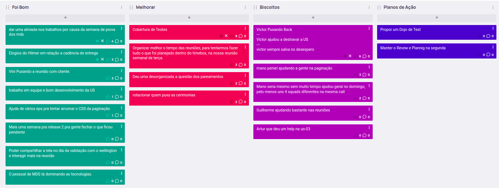

# Sprint 4
## Visão geral
**Data de Inicio:** 06/06/2023

**Data de Término:** 13/06/2023

## Atividades realizadas
### Reunião dia 06/06/2023
**Participantes**

| Papel | Membro |
| ----- | ------ |
| EPS | Arthur Sena, Peniel Zannoukou, Rodrigo Lima, Sérgio Cipriano, Vinícius Souza, Wellington Jonathan | 
| MDS | Ana Cavalcanti, Artur Fontinele, Flávio Melo, Gustavo Sorte, Harryson Martins, Leandro Oliveira, Oscar Neto, Yan Paulo |

- Assuntos abordados:
    - Sprint review
        - As USs da Sprints passada ainda aguardam validação
        - Correção de bug
            - componente de visualizar processo não renderiza na primeira renderização de tela
            - Ao chegar na última etapa, o botão “retroceder etapa” some
        - Fechamos 16 pontos na Sprint passada
        - 3 pontos ainda estão em andamento
    - Planning Poker
        - Adicionar paginação em todas as tabelas - 5
            - Funcionará como um filtro que irá mostrar uma determinada quantidade de informação na tela, para não dar problemas entre o back e o front
        - Remover a filtragem do lado do cliente - 5
            - A parte de filtragem será outra US
                - Teremos que fazer protótipo e validar
    - Sprint Planning
        - quebrar US 07
        - criar US do filtro de finalizado/arquivado
        - modal de confirmação de retroceder etapa
        - levar US’s 26 e 27 para a próxima reunião
        - Foi frisada a importância dos testes
            - Sena fará isso no front e depois fará um dojo para os MDS
    - Retrospectiva - Easy Retro
        - Foi bom 
            - Reunião team building na casa do membro Wellington Jonathan, que ajudou a destravar as USs e proporcionou um tempo de interação entre os membros do grupo
            - Participação dos MDS na reunião com o Cliente
        - Melhorar 
            - Que os MDS aprendam mais, para depender menos dos EPS
            - Comunicação com o cliente está centralizada em pessoas específicas
            - Testes
        - Planos de Ação
            - Manter os dojos ativos, enquanto for necessário (EPS)
            - Manter o aprendizado ativo, além dos pareamentos (MDS)
            - MDS começarem a puxar todo o fluxo de ideação, para tirar essa responsabilidade dos EPS, desde a prototipação até a validação dos critérios de aceitação
            - deixar melhor explicitado as tarefas das USs
            - Manter rodízio de facilitadores e apresentadores dos rituais da semana
                - Quem vai acompanhar o foco da semana, apresentador da reunião com o cliente, responsável pelo ritual - review, retro, dailies etc.
                - Quem deve redigir as atas de reunião
                - Quem vai dividir as tarefas das USs
                - Melhorar a comunicação no Telegram para explicitar todos os focos do time, para além das implementações.

**Redator**: Ana Karoliny de Souza Cavalcanti

### Reunião dia 07/06/2023
**Participantes**

| Papel | Membro |
| ----- | ------ |
| EPS | Peniel Zannoukou, Rodrigo Lima, Sérgio Cipriano, Vinícius Souza, Wellington Jonathan | 
| MDS | Ana Cavalcanti, Artur Fontinele, Gustavo Sorte, Leandro Oliveira, Yan Paulo |

- Assuntos abordados:
    - Foi criada a US40 (5 pts) para fazer a filtragem dos processos finalizados e arquivados
    - US em andamento 
        - US03 (Retrocesso de etapa)
        - Falta fazer a modal de confirmação do botão de retroceder e Corrigir o bug do botão de retrocesso estar sumindo na última etapa.
        - US36 (Arquivar processo)
        - Decidiram que Flávio, Juan, Gustavo e Ana Karol vão continuar o pareamento da sprint passada pois estão no meio de US’s. Os pareamentos ficaram assim então:
            - Leando, Artur e Peniel (5 pontos) #121 - Adicionar paginação em todas as tabelas
            - Oscar, Yan e Rodrigo (5 pontos) #122 - Remover filtragem do lado do cliente (Frontend)
            - Guilherme, Harryson e Vinícius (8 pontos) US07 - Registro de data por etapa
            - Gustavo, Ana e Wellington (correções) US36 - Arquivar e Desarquivar processo (em andamento)
            - Flávio, Juan e Sena (correções) US03 - Retrocesso de etapa (em andamento)
        - Divisão das USs
            - US05 (1 pts) (Gustavo, Ana Karol, Wellington – próxima US depois de terminarem a US36)
            - US07 (8 pts) (Guilherme, Harry, Vinicius)
            - Issue121 (5 pts) (Paginação em todas as tabelas) (Artur, Leandro, Peniel)
            - Issue122 (5 pts) (Remover filtragem do lado do cliente) (Oscar, Yan, Rodrigo)
            - US40 (5 pts) (Flávio, Juan, Sena – próxima US depois de terminarem a US03)

**Redator**: Artur Jackson Leal Fontinele

### Reunião dia 12/06/2023
**Participantes**

| Papel | Membro |
| ----- | ------ |
| Professor | Hilmer Rodrigues Neri |
| Cliente | Wellington José Barbosa Carlos |
| Mentor |  Fernando Miranda |
| EPS | Arthur Sena, Peniel Zannoukou, Sérgio Cipriano, Victor Lucas, Vinícius Souza, Wellington Jonathan | 
| MDS | Ana Cavalcanti, Artur Fontinele, Flávio Melo, Guilherme Gonçalves, Gustavo Sorte, Harryson Martins, Leandro Oliveira, Oscar Neto, Yan Paulo |

- Assuntos abordados:
    - 7 USs que foram validadas
        - US03 – Retroceder Etapa
        - US05 – Visualização da duração de etapas na criação/edição dos fluxos
        - US06 – Status do processo
        - US34 – Início do processo
        - US35 – Finalizar processo
        - US36 – Arquivar processo
        - US41 – Observações sobre o avanço de etapa
    - 2 USs não-finalizadas que foram validadas
        - US07 – Registro de data por etapa
        - US40 – Criar filtro de processos finalizados e arquivados
    - Correção de bugs como a visualização da situação da etapa em Processos
    - Cliente entende que (US26 - Gerenciar Permissões) não existe, as permissões já devem estar previstas. E o gerenciar perfil (US25) atua em criar novos perfis com permissões fixas
        - Exemplo: é criado um perfil visitante, ele deve ter permissões já mapeadas para
aquele tipo de perfil (visitante)
        - Fazer uma reunião sobre o levantamento de permissões para cada perfil com o
cliente
    - Foi decidido um adiamento de uma sprint para finalizar a Release 2
    - Cliente valida a melhoria de desempenho referente a paginação
    - Retroceder etapa referente a US03 possui agora uma modal de confirmamento
    - Cliente concorda com o desmembramento da US07, tornando-se (US07 – Registro de data
por etapa e US41 - Observações sobre o avanço de etapa)
    - O modal de observação é opcional, não é necessário ter que fazer uma para avançar de
etapa

**Redator**: Gustavo França Boa Sorte

## Issues Concluidas
| Issue | Responsáveis(s) |
| ----- | ---------------- |
|[US03 - Retrocesso de Etapas](https://github.com/fga-eps-mds/2023-1-CAPJu-Doc/issues/64)| Arthur Sena, Flávio Melo, Juan Pablo Ricarte |
|[US05 - Visualização da duração de etapas na criação/edição dos fluxos](https://github.com/fga-eps-mds/2023-1-CAPJu-Doc/issues/66)| Ana Cavalcanti, Gustavo Sorte, Wellington Jonathan |
|[US06 - Status do processo](https://github.com/fga-eps-mds/2023-1-CAPJu-Doc/issues/67)| Leandro Oliveira, Peniel Zannoukou, Yan Paulo |
|[US17 - Visualização de feedbacks por ações](https://github.com/fga-eps-mds/2023-1-CAPJu-Doc/issues/84)| Arthur Sena, Wellington Jonathan |
|[US26 - Gerenciar permissões](https://github.com/fga-eps-mds/2023-1-CAPJu-Doc/issues/93)| Artur Fontinele, Arthur Sena, Oscar Neto, Wellington Jonathan |
|[US27 - Mapeamento pela interface](https://github.com/fga-eps-mds/2023-1-CAPJu-Doc/issues/94)| Artur Fontinele, Arthur Sena, Oscar Neto, Wellington Jonathan |
|[US35 - Finalizar processo](https://github.com/fga-eps-mds/2023-1-CAPJu-Doc/issues/166)| Artur Fontinele, Guilherme Gonçalves, Vinícius Souza |
|[US36 - Arquivar processo](https://github.com/fga-eps-mds/2023-1-CAPJu-Doc/issues/167)| Ana Cavalcanti, Gustavo Sorte, Wellington Jonathan |
|[Situação atual do processo deve ser apresentado em forma de fração](https://github.com/fga-eps-mds/2023-1-CAPJu-Doc/issues/182)| Artur Fontinele, Arthur Sena, Guilherme Gonçalves |
|[BUG - Botão de Finalizar quando processo está finalizado](https://github.com/fga-eps-mds/2023-1-CAPJu-Doc/issues/187)| Guilherme Gonçalves, Vinícius Souza |
|[BUG - Padronizar botões na visualização do Fluxo](https://github.com/fga-eps-mds/2023-1-CAPJu-Doc/issues/188)| Guilherme Gonçalves, Vinícius Souza |
|[BUG - Botão de Retroceder Etapa quando estiver na última etapa](https://github.com/fga-eps-mds/2023-1-CAPJu-Doc/issues/189)| Guilherme Gonçalves, Vinícius Souza |

## Retrospectiva

## Histórico de versão
| Data | Versão | Descrição | Autor(es) |
| ---- | ---- | ---- | ---- |
| 18/06/2023 | 0.1.0 | Criação do Documento | Ana Cavalcanti e Guilherme Gonçalves |
| 21/06/2023 | 0.1.1 | Atualização do Documento | Ana Cavalcanti e Guilherme Gonçalves |