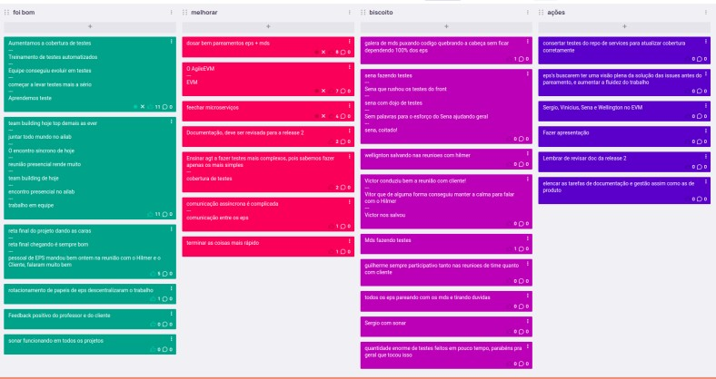

# Sprint 5
## Visão geral
**Data de Inicio:** 13/06/2023

**Data de Término:** 20/06/2023

## Atividades realizadas
### Reunião dia 13/06/2023
**Participantes**

| Papel | Membro |
| ----- | ------ |
| EPS | Arthur Sena, Peniel Zannoukou, Rodrigo Lima, Victor Lucas, Vinícius Souza, Wellington Jonathan | 
| MDS | Ana Cavalcanti, Artur Fontinele, Flávio Melo, Guilherme Gonçalves, Gustavo Sorte, Harryson Martins, Juan Pablo Ricarte, Leandro Oliveira, Oscar Neto |

- Assuntos abordados:
    - Sprint Review
        - As US Remover filtragem do cliente (Issue #122), adicionar paginação (Issue #121) e
US07 estão em andamento
        - US finalizadas: 03, 05, 06, 34, 35, 36
        - Fechamos 20 pontos de US nessa última semana
    - Planning
        - Corrigir bug da situação atual do processo:
            - Quando entra a primeira vez na página dos processos, situação atual fica n/undefined.
    - USs para próxima Sprint:
        - US41 Observações sobre avanço de etapas (8 pts)
        - US16 Visualização do tutorial (8 pts)
        - US18 Visualização de contribuidores (3 pts)
        - US19 Visualização de indicações (5 pts) (US17 foi contemplada na US19)

**Redator**: Artur Jackson Leal Fontinele

### Reunião dia 14/06/2023
**Participantes**

| Papel | Membro |
| ----- | ------ |
| Professor | Hilmer Rodrigues Neri |
| Cliente | Wellington José Barbosa Carlos |
| Mentor |  Fernando Miranda |
| EPS | Peniel Zannoukou, Rodrigo Lima, Victor Lucas, Vinícius Souza, Wellington Jonathan | 
| MDS | Ana Cavalcanti, Artur Fontinele, Flávio Melo, Guilherme Gonçalves, Gustavo Sorte, Harryson Martins, Leandro Oliveira, Oscar Neto, Yan Paulo | 

- Assuntos Abordados:
    - Retrospectiva
        - Foi usado o EasyRetro
            - Foi bom
                - Cadenciar menos atividades devido a semana de provas referente aos MDS
                - Professor entende que o projeto CAPJu está andando conforme o esperado
            - Melhorar
                - Organizar o tempo (timebox) das reuniões
                - Ocorrência de desorganização dos pareamentos
                - descrever os post mais comentados
            - Planos de Ações
                - Propor um dojo de Testes
                - Manter o review e planning na segunda-feira
                - descrever os post mais comentados
    - Definição de novos pareamentos com as suas respectivas USs para a próxima sprint
        - Leandro, Artur, Peniel - (US19)
        - Oscar, Yan, Rodrigo - (US16)
        - Guilherme, Harryson, Vinicius - (US16)
        - Gustavo, Flávio, Wellington - (US16)
        - Ana, Juan, Sena - (US41)
        - Sergio, Victor - (US18)
        - US40, US07, issue 122 (remover filtragem do lado do cliente) e issue 121 (paginação) ainda
precisa ser finalizada.

**Redator**: Gustavo França Boa Sorte

### Reunião dia 19/06/2023
**Participantes**

| Papel | Membro |
| ----- | ------ |
| Professor | Hilmer Rodrigues Neri |
| Cliente | Wellington José Barbosa Carlos |
| Mentor |  Fernando Miranda |
| EPS | Arthur Sena, Peniel Zannoukou, Rodrigo Lima, Sérgio Cipriano, Victor Lucas, Vinícius Souza, Wellington Jonathan | 
| MDS | Ana Cavalcanti, Artur Fontinele, Flávio Melo, Guilherme Gonçalves, Gustavo Sorte, Harryson Martins, Leandro Oliveira, Oscar Neto, Yan Paulo |

- Assuntos abordados:
    - Foi mostrado o andamento do Sonar Cloud e a cobertura de testes de cada
repositório.
    - Foi apresentado o EVM para o Cliente
    - Foi definido que a opção de adicionar observações deverá estar presente
sempre entre as etapas
        - Para que o usuário consiga inserir observações onde ele preferir, por mais que ela não seja obrigada a colocar em todas, além disso, depois que a observação for feita, ela deverá se destacar dos demais elementos, seja por uma cor chamativa ou por outro detalhe. 
        - Outro fator que ficou definido é que esse botão de observação não é necessário antes de iniciar um processo.
    - Sobre a data de vencimento
        - É a quantidade de dias de duração de cada etapa,sem contar o dia atual da etapa em questão,
        até às 23:59

**Redator**: Flávio Gustavo Araújo de Melo

## Issues Concluidas
| Issue | Responsáveis(s) |
| ----- | ---------------- |
|[Configurar CI utilizando sonarcloud](https://github.com/fga-eps-mds/2023-1-CAPJu-Doc/issues/2)| Arthur Sena, Sérgio Cipriano |
|[Atualização das Atas](https://github.com/fga-eps-mds/2023-1-CAPJu-Doc/issues/62)| Ana Cavalcanti, Guilherme Gonçalves |
|[Serviço de Gerenciamento de Processos](https://github.com/fga-eps-mds/2023-1-CAPJu-Doc/issues/178)| Victor Lucas |

## Retrospectiva

## Histórico de versão
| Data | Versão | Descrição | Autor(es) |
| ---- | ---- | ---- | ---- |
| 21/06/2023 | 0.1.0 | Criação do Documento | Ana Cavalcanti e Guilherme Gonçalves |
| 04/07/2023 | 0.1.1 | Atualização do Documento | Ana Cavalcanti e Guilherme Gonçalves |
