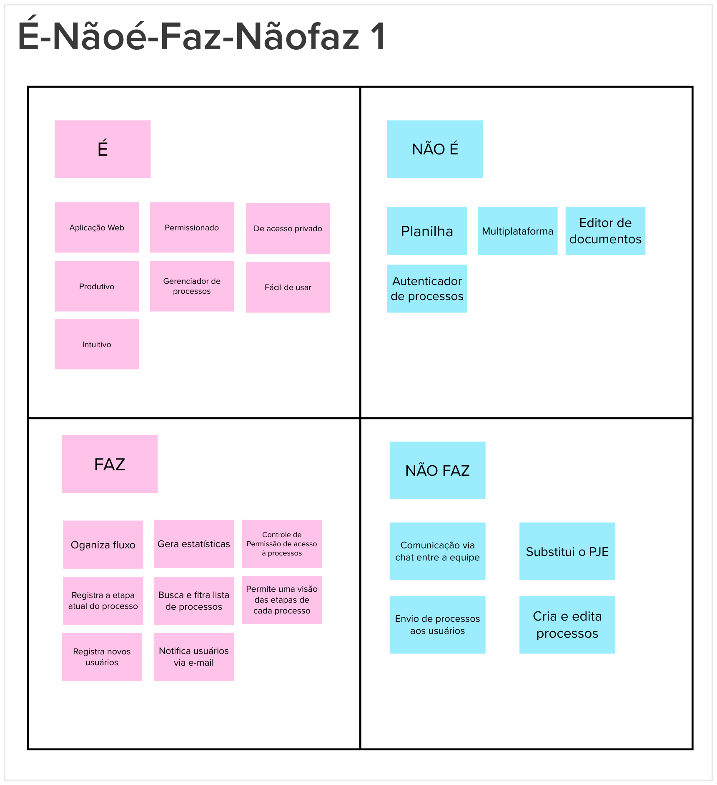

# Lean Inception

## 1. O que é Lean Inception

É um método utilizado por metodologias ágeis para compreender e direcionar o projeto em seu estágio inicial. Ele auxilia no entedimento das principais funcinalidades que os clientes estimam para o produto, visando construir a definição do MVP (Produto Mínimo Viável).

O Lean Inception é dividido em dez atividades, feitas em conjunto pela equipe, a fim de chegarem a um melhor entendimento do produto e decidir o MVP.

## 2. Kick-off

O kick-off é a primeira atividade do Lean Inception, será idetificado quem participará de cada etapa do lean inception e quem irá participar apenas do kick-off e do showcase, é feito então a abertura das atividades por meio de um discurso sobre a iniciativa, além de ser apresentado a agenda da lean inception.

## 3. Visão do Produto

Essa é a primeira etapa para se entender o produto e como ele agrega valor ao negócio dos clientes. Nela são identificados importantes questões relacionadas ao produto, como exemplo, o prolema a ser solucionado, a categoria do produto, os usuários do produto e seu diferencial, fazendo uma junção dasa "peças" do negócio.

## 4. O Produto É - NÃO É - FAZ - NÃO FAZ

O principal objetivo dessa etapa, além de contribuir para o entedimento do produto é identificar os aspectos positivos e negativos do produto sobre o produto ser ou fazer algo. Para essa atividade os contribuintes separaram em quatro quadrantes o que entendem que o produto é, não é, faz e não faz. Assim, por meio desses quadrantes o grupo tem maior entendimento da categoria do produto e o que de fato espera-se que ele seja capaz de fazer e o que não deve fazer.

## 5. Objetivos do Produto

A ideia dessa atividade é levantar e esclarecer os objetivos do produto. Para isso, cada integrante compartilha suas ideias e pontos de vista afim de chegar em um consenso sobre o que é importante.

## 6. Personas 

A execução dessa etapa consistiu na divisão do time em três grupos a fim de expor possíveis usuários do negócio. Esse processo cria personagens que auxiliarão o time a descrever funcionalidades de acordo com quem vai interagir com o produto final, apresentando não só o papel, mas também as características e necessidades dos prováveis usuários.

## 7. Jornada do Usuário

Juntamente com o exercício de personas, esta atividade procura traçar, de forma sequencial, a jornada dos usuários criados até alcançar um objetivo. O intuito é alegar os diferentes pontos de contato e a interação dos envolvidos com o produto.

 

## 8. Brainstorming de Funcionalidades

Nesta fase chega-se às funcionalidades. O objetivo é determinar as ações e interações funcionais que o usuário terá com o produto de acordo com suas necessidades e objetivos de negócio que agregarão valor. A atividade foi realizada em conjunto, descrevendo-se de forma simples e concisa as possíveis aplicações e, ao final, chegando-se a um consenso.

## 9. Revisão Técnica, de Negócio e de UX

Nesta revisão, foi esboçado o conhecimento técnico do time para cada funcionalidade de acordo com o que fazer e como fazer, sendo vermelho para baixo, amarelo para médio e verde para alto entendimento. Além disso, foi descrito, em uma escala de 1 a 3, como o time julgava cada aplicação em níveis de esforço (E), negócio ($) e UX (<3). Essa fase ajuda na compreensão da complexidade e importância das funcionalidades, consequentemente, da priorização, estimação e planejamento.

## 10. Sequenciador

O Sequenciador serve para deixar as funcionalidades de forma sequencial ao desenvolvimento, informando quais aplicações serão implementadas no MVP (Mínimo Produto Viável) e o que será incremento. A etapa auxilia na visualização e organização da validação das ideias. É importante ressaltar que a atividade é discorrida a partir de regras estabelecidas pela Lean Inception.

## 11. Canvas MVP

Esta é a etapa final da Lean Inception. Trata-se de um quadro que resume as discuções e definições das fases anteriores a fim de apresentar um MVP que possa ser validado e utilizado pelo usuário. Este processo ajuda a definir estratégias de desenvolvimento e traz como critérios a proposta do MVP, personas segmentadas, jornadas, funcionalidades, resultado esperado, métricas para validar as hipóteses do negócio e custo e cronograma.

## Rerefências

Capju. Capju. lean inception. Disponível em: <a href="https://fga-eps-mds.github.io/2022-2-CAPJu-Doc/#/pages/documentation/leaninception">https://fga-eps-mds.github.io/2022-2-CAPJu-Doc/#/pages/documentation/leaninception</a>. Acesso em: 29 de mai. de 2023.

Paulo, Caroli. Lean Inception, 2003. Disponível em: <a href="https://caroli.org/livro/lean-inception-como-alinhar-pessoas-e-construir-o-produto-certo/">https://caroli.org/livro/lean-inception-como-alinhar-pessoas-e-construir-o-produto-certo/</a>. Acesso em: 10 de dez. de 2022.

## Histórico de Versões

| Data | Versão | Descrição | Autor(es) | Revisor(es) |
| ------------- | ------------- | ------------- | ------------- | ------------- | 
| 29/04/2023 | 0.1.0 | Criação do documento | Wellington Jonathan | Ana Karoliny, Guilherme de Sá, Gustavo Sorte, Juan Pablo, Vinicius Vieira |